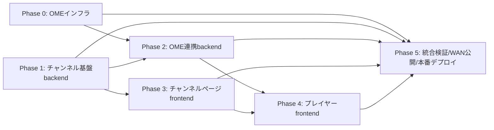

# 06. 実装工程書 — ライブチャンネル機能

作成日: 2026-07-14
対象リポジトリ: `misskey-repo` (branch: `bsky-integration`)
ステータス: 設計確定 (未実装)。**本書は実装セッションが最初に開く作業指示書。**

## 0. この文書の使い方

実装を担当する LLM は本書を読み、担当する Work Item (以下 WI) を 1 つ選び、WI の「参照節」列に
挙げた設計書 (00〜05) の該当節を読んでから着手する。本書自体は設計の詳細を再掲しない — 設計内容は
必ず参照先の原本を読むこと (原本と本書の記述が食い違う場合は原本が正)。

読み順: **本書 (06) → `00-overview.md` → 担当 Phase の設計書 (01〜05)**。

### 0.1 運用ルール — 各 WI 完了時の必須チェック

各 WI の「完了条件」を満たした後、コミット前に必ず以下を実施する (`shipping-misskey-change` skill 相当)。
チェック内容は WI の性質によって取捨する (frontend のみの WI で `check-migrations` は不要、等)。

| チェック | コマンド | 対象 WI |
|---|---|---|
| lint (typecheck + eslint) | `pnpm lint` (全体) または `pnpm --filter backend lint` / `pnpm --filter frontend typecheck` (個別) | 全 WI |
| migration 差分 0 件 | `pnpm --filter backend check-migrations` | entity/migration を触る WI |
| misskey-js 再生成 | `pnpm build-misskey-js-with-types` | backend API (endpoint の meta/paramDef/res) を変更した WI |
| SPDX ヘッダー | 新規 `.ts`/`.js`/`.vue` ファイルの先頭を目視確認 (AGENTS.md 絶対禁止事項#1) | 新規ファイルを作る全 WI |
| ja-JP.yml のみ差分 | `git diff --name-only develop -- 'locales/*.yml' \| grep -v '^locales/ja-JP\.yml$'` が空 | `locales/` を触る WI |
| CHANGELOG | `CHANGELOG.md` の `## Unreleased` 配下にユーザー影響のある変更を1行追記 | ユーザー visible な変更を含む WI |

### 0.2 既知の罠 (冒頭集約 — 実装前に必ず目を通す)

1. **frontend-embed の typecheck が HEAD から壊れている**: `pnpm lint` を全体実行すると `packages/frontend-embed`
   の既存 (本機能と無関係の) typecheck エラーで失敗する可能性がある。本機能の WI で新規に埋め込んだエラーか
   判別できない場合は、`pnpm --filter backend lint` / `pnpm --filter frontend typecheck` / `pnpm --filter
   misskey-js lint` のようにパッケージ個別に実行し、触っていないパッケージのエラーは既知の壊れとして無視してよい。
   ただし「本当に無関係か」は差分ファイルパスとエラーファイルパスを突き合わせて確認すること (盲目的な無視は禁止)。
2. **`migration:generate` の既知ノイズ**: `pnpm --filter backend migration:generate` (または schema sync
   dry-run) を使うと、bsky-fork 独自の `atDid`/`isBot` partial unique index に対する意図しない `DROP`/`CREATE`
   が生成物に混入することがある (02 §3、03 §9-3 に既知ノイズとして明記済み)。生成された SQL は必ず目視確認し、
   これらの行を手で除去してから migration ファイルに反映すること。
3. **e2e はローカル test DB 前提**: `pnpm --filter backend test:e2e` を実行する前に `.config/test.yml` が必要。
   `ncp .github/misskey/test.yml .config/test.yml` (または `cp`) で作成する (AGENTS.md 記載)。CI 上のみで
   動作確認するのではなく、実装セッション内でローカル e2e を通してから完了報告すること。
4. **`working-on-backend` / `working-on-frontend` skill は必読**: AGENTS.md 絶対禁止事項#13/#14 により、
   `packages/backend/`・`packages/frontend/` を編集する WI はすべて対応する skill を参照してから着手する
   (本書はその代替にならない)。
5. **`shipping-misskey-change` skill は commit/PR 前に必ず参照**: §0.1 の表は同 skill の要約に過ぎない。
   skill 本体に更新があれば skill の内容が優先する。

---

## 1. Phase 依存関係

```
Phase 0 (OME インフラ) ──┐
                          ├──> Phase 2 (OME連携 backend) ──> Phase 4 (プレイヤー frontend) ──> Phase 5 (統合検証・WAN公開・本番デプロイ)
Phase 1 (チャンネル基盤   ┘         ↑                              ↑
        backend)  ──────────────────┘                              │
        └────────────────────────────> Phase 3 (チャンネルページ frontend) ┘
```

- **Phase 0 と Phase 1 は並行可** (互いに依存しない。00-overview §4 の表どおり)。
- Phase 2 は Phase 0 (OME 実稼働) と Phase 1 (`live_channel` テーブル) の両方が完了して初めて着手できる。
- Phase 3 は Phase 1 のみに依存する (OME 非依存で `live_channel` の CRUD UI が作れるため、Phase 2/4 完了前に
  着手できる)。
- Phase 4 は Phase 2 (backend のセッション統合・`sessions` レスポンス) と Phase 3 (`live-stream.vue` の
  3 状態分岐という土台) の両方に依存する。
- Phase 5 は全 Phase 完了後。

Mermaid 版 (レンダリング対応ツールで見る場合):



---

## 2. Work Item 一覧 (進捗トラッキング表)

実装セッションはこの表の「状態」列を更新していく。凡例: `[ ]` 未着手 / `[~]` 着手中 / `[x]` 完了。
複数セッションにまたがる WI は、担当セッション終了時に本表と該当セルに一言メモ (完了した部分・残作業) を残すこと。

| ID | Phase | Work Item | 状態 | 依存 |
|---|---|---|---|---|
| WI-0.1 | 0 | PVE2 LXC 作成 + Docker インストール | [ ] | なし |
| WI-0.2 | 0 | OME コンテナ起動 + Server.xml 初期版 (AdmissionWebhooks 無効) | [ ] | WI-0.1 |
| WI-0.3 | 0 | シークレット生成 + config 対応表確定 | [ ] | WI-0.2 |
| WI-0.4 | 0 | LAN 内疎通検証 (a)〜(d) + 未確定事項 1,2,4,5,7 の実機解消 | [ ] | WI-0.3 |
| WI-0.5 | 0 | **[BLOCKING/人間承認] WAN 公開 (OPNsense NAT/HAProxy/DNS)** | [ ] | WI-0.4、ユーザー承認 |
| WI-1.1 | 1 | `live_channel` entity + migration + 登録4点セット + CoreModule登録 | [x] | なし |
| WI-1.2 | 1 | `LiveChannelService` 実装 (create/update/regenerateStreamKey/show/pack) | [x] | WI-1.1 |
| WI-1.3 | 1 | API endpoint 5本 (`live-channels/*`) + misskey-js 再生成 | [x] | WI-1.2 |
| WI-1.4 | 1 | i18n (`_liveChannel`) + e2e (`live-channel.ts`) | [x] | WI-1.3 |
| WI-2.1 | 2 | `config.ts` に `ome` ブロック追加 (Source/Config/解決ロジック) | [ ] | Phase 0, 1 完了 |
| WI-2.2 | 2 | `OmeApiService` (REST API クライアント) + `LiveLoggerService` | [ ] | WI-2.1 |
| WI-2.3 | 2 | `OmeServerService` (`/ome/admission` raw route + HMAC検証) | [ ] | WI-2.2 |
| WI-2.4 | 2 | `OmeAdmissionService` (判定ロジック) + 通知 `liveStreamStarted` 7点セット | [ ] | WI-2.3 |
| WI-2.5 | 2 | セッション統合 migration (`twitch_stream.source`) + 既存サービスへのガード追加 | [ ] | WI-1.1 |
| WI-2.6 | 2 | `LiveChannelService.generateIngestUrls()` + ingest URL を返す endpoint の確定・実装 | [ ] | WI-2.2, WI-1.3 |
| WI-2.7 | 2 | `OmeStreamMonitorService` (ポーリング・遮断・自己修復) | [ ] | WI-2.4, WI-2.5 |
| WI-2.8 | 2 | `twitch/streams/show` の `sessions` 配列拡張 + misskey-js 再生成 | [ ] | WI-2.5 |
| WI-2.9 | 2 | e2e (`ome-admission.ts`) + `check-migrations` | [ ] | WI-2.4, WI-2.5, WI-2.7, WI-2.8 |
| WI-2.10 | 2 | AdmissionWebhooks 有効化 (Server.xml 反映、01 §6(e)) | [ ] | WI-2.3, WI-0.2 |
| WI-3.1 | 3 | `live-stream.vue` データ取得層改修 (`reload()`) + 3状態分岐 | [x] | WI-1.3 |
| WI-3.2 | 3 | `live-stream.channel-home.vue` 新設 (バナー/名前/説明/フォロー/タイムライン) | [x] | WI-3.1 |
| WI-3.3 | 3 | `/settings/live-channel` 設定ページ新設 + router 登録 | [x] | WI-1.3, WI-2.6 |
| WI-3.4 | 3 | i18n (frontend専用キー) + 目視検証 (3状態×PC/モバイル/デッキ) | [~] | WI-3.2, WI-3.3 |
| WI-4.1 | 4 | `ovenplayer` 依存追加 + `MkOmePlayer.vue` | [ ] | WI-2.8 |
| WI-4.2 | 4 | `MkTwitchPlayer.vue` + `MkStreamPlayer.vue` | [ ] | WI-4.1 |
| WI-4.3 | 4 | `live-stream.vue` セグメントトグル・チャット `streamId` 追従統合 | [ ] | WI-4.2, WI-3.1 |
| WI-4.4 | 4 | 実機検証チェックリスト (自動再生・切替・全画面・再接続) | [ ] | WI-4.3 |
| WI-5.1 | 5 | 統合検証シナリオ (実配信テスト、OBS 設定値含む) | [ ] | Phase 0-4 完了 |
| WI-5.2 | 5 | 本番デプロイ手順 (CI/CD 前提、migration 含むデプロイの注意) | [ ] | WI-5.1 |
| WI-5.3 | 5 | ロールバック方針の文書化・訓練 | [ ] | WI-5.2 |
| WI-5.4 | 5 | **[BLOCKING/人間承認] 本番 mi-host `default.yml` に `ome:` セクション投入** | [ ] | WI-0.5、WI-5.2、ユーザー承認 |

---

## 3. Phase 0: OME インフラ構築

参照節: `01-infra-ome-setup.md` 全体。

### WI-0.1: PVE2 LXC 作成 + Docker インストール

- 参照節: 01 §2 (2.1〜2.5)
- 触るファイル: なし (インフラ作業、リポジトリ外)
- 完了条件:
  - `pvesh get /cluster/nextid` で確定した VMID で LXC (Debian 12) が `pct create` 済み
  - `pct start <VMID>` 後 `pct exec <VMID> -- docker version` と `docker compose version` がエラーなく
    バージョン文字列を返す
- コミット単位: なし (インフラのみ、リポジトリへのコミットは発生しない)。作業ログは基地local (`~/.claude/memory/`
  等、プロジェクト外) に残すことを推奨するが必須ではない。

### WI-0.2: OME コンテナ起動 + Server.xml 初期版

- 参照節: 01 §3, §4
- 触るファイル: `ome` LXC 内の `/opt/ome/compose.yml`、`Server.xml` (リポジトリ外)
- 完了条件:
  - `docker compose up -d` でコンテナが起動し、`docker compose logs ome` にパースエラー・ポートバインド失敗が
    無い
  - Server.xml は 01 §4 の完全版を反映し、`<AdmissionWebhooks>` はコメントアウトしたまま (01 §6(e) の
    「無効化がデフォルト」を厳守— Phase 2 の `/ome/admission` が存在しない段階で有効化すると全 ingest が
    拒否される)
- コミット単位: なし

### WI-0.3: シークレット生成 + config 対応表確定

- 参照節: 01 §5
- 触るファイル: なし (値のメモのみ。`.config/default.yml` への実反映は WI-2.1/WI-5.4)
- 完了条件: API AccessToken / AdmissionWebhooks SecretKey / SignedPolicy SecretKey の 3 種を個別に生成し、
  Server.xml (該当箇所) に反映済み。3 値を後続 Phase 2 実装者に引き継げる形で記録済み (プロジェクトの
  秘密情報の扱いは CLAUDE.md §7 に従う — 平文でリポジトリにコミットしない)
- コミット単位: なし

### WI-0.4: LAN 内疎通検証 + 未確定事項の実機解消

- 参照節: 01 §6 (a)〜(d)、00-overview §5 の未確定事項 #1, #2, #4, #5, #7
- 触るファイル: `doc/live-streaming/00-overview.md` (未確定事項表の更新)、`doc/live-streaming/01-infra-ome-setup.md`
  (実測値の反映)
- 完了条件:
  - (a) REST API 応答確認: `statusCode:200` かつ空配列レスポンス
  - (b) OBS → RTMP ingest: ストリーム一覧に反映される
  - (c) WebRTC 再生確認: OvenPlayer デモページ等で映像・音声が数百ms遅延で再生される
  - (d) `bitrateLatest`/`bitrateAvg`/`bitrateConf`/`bitrate` の実測記録が取得され、**未確定事項#4 (どのフィールドが
    瞬間実測値か) が確定**している
  - 追加で以下を実機確認し 00-overview.md §5 の該当行を更新する:
    - 未確定事項#1: `Server.xml` の `SignedPolicy/Enables/Providers` に `webrtc`/`srt` を設定して起動エラーが
      出ないか (パーサが受理するか)。受理されない場合は 03 §6 の縮退手順 (`rtmp` のみに変更) を適用したことを
      記録する
    - 未確定事項#2: `GET /v1/stats/current/vhosts/{vhost}/apps/{app}/streams/{stream}` のレスポンスに
      `totalConnections` 相当のキーが実在するか (キー名を記録)
    - 未確定事項#5: OBS の WHIP 出力設定で Bearer Token 欄と SignedPolicy の `policy`/`signature` クエリを
      併用できるか。不可なら 03 §6 で既に採用済みの「query 直付け」方式のままでよいことを確認するのみ
    - 未確定事項#7: 負荷試験の初期値 (Phase 0 時点では厳密な上限測定はしない。`docker stats ome` を配信中に
      実行し、ベースライン値を記録するのみ — 本格負荷試験は WI-5.1)
- コミット単位: 1コミット。`doc/live-streaming/00-overview.md` の未確定事項表 (§5) と `01-infra-ome-setup.md`
  の該当箇所 (Server.xml のコメント、config 対応表) を実測値で更新するのみ (docs commit)。

### WI-0.5: [BLOCKING] WAN 公開

- 参照節: 01 §7 全体
- **承認状況 (2026-07-14)**: 未確定事項#6 は**ユーザー承認済み** — FQDN は `stream.msjp.pro` 確定、
  WAN 公開ポリシー例外も許容。ただし二重ルーター構成のため **上位ルーターのポート開放 (01 §7.1.5 の
  4 項目) は人間の手動作業** であり、この完了までは本 WI はブロックされたまま。OPNsense 側の変更
  (§7.2 以降) も実施直前に個別確認を取ること (CLAUDE.md §3)。未完了の間、Phase 2〜4 の実装は
  LAN 内動作のみを前提に進めてよい (03・04・05 いずれも LAN 内動作を前提に書かれている)。
- 触るファイル: OPNsense 設定 (NAT/HAProxy/DNS、リポジトリ外)、`doc/live-streaming/01-infra-ome-setup.md`
  (実施後のIceCandidates切替記録)
- 完了条件: 01 §7.1〜§7.6 をすべて実施し、§7.6 の事後検証コマンド (WAN外からの nc/curl) が期待どおり応答する。
  CLAUDE.md §10 のとおり OPNsense config export を事前取得済みであること
- コミット単位: なし (インフラ変更)。事後、`homelab-ops` の WAN 監査ノートを更新する (プロジェクト外)

---

## 4. Phase 1: チャンネル基盤 (backend)

参照節: `02-backend-channel.md` 全体。この Phase は `config.ome` に一切依存せず完結する (02 §9 の完了条件)。

### WI-1.1: `live_channel` entity + migration + 登録4点セット

- 参照節: 02 §1 (entity), §2 (登録4点セット + CoreModule注記), §3 (migration)
- 触るファイル:
  - `packages/backend/src/models/LiveChannel.ts` (新規)
  - `packages/backend/src/postgres.ts` (差分)
  - `packages/backend/src/models/_.ts` (差分)
  - `packages/backend/src/models/RepositoryModule.ts` (差分)
  - `packages/backend/src/di-symbols.ts` (差分)
  - `packages/backend/migration/{unixMs}-AddLiveChannel.js` (新規、タイムスタンプは `node -e
    "console.log(Date.now())"` で都度取得)
- 完了条件:
  - `pnpm --filter backend check-migrations` が pending DDL 0 件で通る (§0.2 の既知ノイズに注意)
  - `pnpm --filter backend lint` が通る (DI 登録漏れがあれば起動時エラーになるため、可能なら
    `pnpm --filter backend build` または起動確認まで行う)
- コミット単位: 1コミット (`feat(live-channel): live_channel テーブルと登録一式を追加`)。CoreModule.ts への
  `LiveChannelService` 登録は WI-1.2 で実体ファイルができてから行うため、本 WI では entity/migration/DI 登録の
  4点セットのみをスコープとする (CoreModule 4箇所登録は WI-1.2 に含める)。

### WI-1.2: `LiveChannelService` 実装

- 参照節: 02 §4
- 触るファイル:
  - `packages/backend/src/core/live/LiveChannelService.ts` (新規)
  - `packages/backend/src/core/live/LiveLoggerService.ts` (新規、`TwitchLoggerService.ts` の `s/twitch/live/`
    移植。03 §2 末尾で言及されている前提ファイルだが、02 の時点で作成してよい)
  - `packages/backend/src/core/CoreModule.ts` (差分、4箇所: import・provider定義・providers配列2箇所・exports
    配列2箇所 — 02 §2-5 の注記どおり計5箇所、`Twitch` で grep して漏れなく洗い出すこと)
- 完了条件: `create`/`update`/`regenerateStreamKey`/`show`/`pack` の5メソッドが実装され、`pnpm --filter backend
  lint` が通る。DI 解決エラーが無いこと (アプリ起動確認、または後続 WI-1.3 の e2e で間接確認)
- コミット単位: 1コミット (`feat(live-channel): LiveChannelService を追加`)

### WI-1.3: API endpoint 5本 + misskey-js 再生成

- 参照節: 02 §5 (5-1〜5-5、endpoint-list.ts追記位置)
- 触るファイル:
  - `packages/backend/src/server/api/endpoints/live-channels/show.ts` (新規)
  - `packages/backend/src/server/api/endpoints/live-channels/create.ts` (新規)
  - `packages/backend/src/server/api/endpoints/live-channels/update.ts` (新規)
  - `packages/backend/src/server/api/endpoints/live-channels/regenerate-key.ts` (新規)
  - `packages/backend/src/server/api/endpoints/live-channels/my.ts` (新規)
  - `packages/backend/src/server/api/endpoint-list.ts` (差分)
  - `packages/misskey-js/src/autogen/` (再生成、コミットに含める)
- 完了条件:
  - 02 §8-2 の curl 例 (create → my → 他人からの show → regenerate-key) がすべて期待どおりの結果を返す
  - `pnpm build-misskey-js-with-types` 実行後、`packages/misskey-js/src/autogen/` に差分がある
- コミット単位: 1コミット (`feat(live-channel): live-channels API 5本を追加`)。misskey-js の自動生成差分は
  同一コミットに含める (AGENTS.md 最低チェック#2)。

### WI-1.4: i18n + e2e

- 参照節: 02 §7 (i18n 表)、§8-3 (e2e ケース列挙)
- 触るファイル:
  - `locales/ja-JP.yml` (差分、`_liveChannel:` セクション新設)
  - `packages/backend/test/e2e/live-channel.ts` (新規)
- 完了条件:
  - `git diff --name-only develop -- 'locales/*.yml' | grep -v '^locales/ja-JP\.yml$'` が空
  - `.config/test.yml` 作成後 `pnpm --filter backend test:e2e -- live-channel` (または同等のフィルタ) で
    02 §8-3 の9ケースすべてが pass する
- コミット単位: 1コミット (`test(live-channel): e2e とi18nキーを追加`)。Phase 1 全体の完了条件チェックリスト
  (02 §「完了条件チェックリスト」冒頭) を最終確認してから Phase 1 完了とする。
- **2026-07-14 実装セッション完了メモ**: `locales/ja-JP.yml` への `_liveChannel:` 追記 (`_twitch:` 直後、
  `_remoteGuestLogin:` の前) と `test/e2e/live-channel.ts` (9ケース) は実装済み。`git diff --name-only
  upstream/develop -- 'locales/*.yml'` は `ja-JP.yml` のみで確認済み。
  - ローカル test DB は当初 docker/podman の rootless namespace エラーで起動不能だったが、原因は
    Claude Code のツール実行サンドボックス自体がネストした user namespace 内で動いていたことで
    (ホストの実ターミナルでは `podman ps` が正常動作、システム全体の障害ではなかった)、
    実ターミナルで `docker compose -f compose.local-db.yml up -d --wait` を実行してもらい復旧した。
  - `.config/docker.env` を新規作成 (POSTGRES_HOST_AUTH_METHOD=trust、default.yml/test.yml の
    `pass: ''` に合わせた)。さらに `.config/default.yml`/`.config/test.yml` の `db.port`/`redis.port` を
    `compose.local-db.yml` の実マッピング (5432/6379) に合わせて修正 (元は 54312/56312 で compose と
    不整合だった。いずれも `.gitignore` 対象のローカル専用ファイル)。
  - `pnpm --filter backend check-migrations` 実行で `AddLiveChannel` migration の制約名が TypeORM 生成の
    実ハッシュ名と不一致であることが判明 (`bannerId` への `REL_` unique 制約も脱漏していた)。実際に
    生成された名前 (`PK_43a1eee100c501a88c0faa3d4c5` 等) に migration ファイルを更新し、
    `pending DDL 0 件` を確認。`pnpm migrate` → `pnpm revert` → `pnpm migrate` の往復も成功。
  - `pnpm --filter backend test:e2e -- live-channel` (直接は `vitest run --config vitest.config.e2e.ts
    test/e2e/live-channel.ts`) で 9/9 pass。当初「未認証で create/update/regenerate-key/my」テストが
    401 期待で失敗したが、これは `secure: true` エンドポイントの既存仕様 (`ApiCallService.call()` の
    secure チェックが requireCredential より先に走り 400 ACCESS_DENIED を返す。
    `twitch/generate-oauth-url` 等の既存 secure:true endpoint と同型) と判明し、テストの期待値を
    400 に修正して解消 (実装側のバグではない)。
  - フルスイート実行時に `test/e2e/users.ts` で `twitchLive` フィールド関連の失敗が 73 件出たが、
    これは既存コミット (`feat(twitch): 配信ライブステータス追跡とプロフィールLIVEバッジ`) 由来の
    既存テストドリフトであり、本セッションの変更とは無関係 (git status で該当ファイル無差分を確認済み)。
    対応は本 Phase のスコープ外。
  - `pnpm --filter backend lint` (typecheck+eslint) と `pnpm build-misskey-js-with-types` も実行済み・
    共にエラー無し。**Phase 1 (WI-1.1〜1.4) は完了。**

---

## 5. Phase 2: OME 連携 (backend)

参照節: `03-backend-ome-integration.md` 全体。**Phase 0 と Phase 1 の両方が完了するまで着手しない。**

### WI-2.1: `config.ts` に `ome` ブロック追加

- 参照節: 03 §1 (1-1〜1-3)
- 触るファイル: `packages/backend/src/config.ts` (差分、3箇所: Source型/Config型/解決ロジック)
- 完了条件: `.config/default.yml` に `ome:` を書かない状態で `config.ome === undefined` になること、必須7項目
  (`apiUrl`/`apiToken`/`admissionSecret`/`signedPolicySecret`/`publicSignallingUrl`/`publicRtmpUrl`/
  `publicSrtUrl`) を揃えた状態で `config.ome` が解決されデフォルト値 (`vhost:'default'` 等) が適用されること。
  ユニットテストが無ければ `node -e` 相当の簡易スクリプトか既存 `twitch` config のテストパターンに倣ったテストを
  追加する
- コミット単位: 1コミット (`feat(ome): config.ts に ome ブロックを追加`)

### WI-2.2: `OmeApiService` + `LiveLoggerService` 確認

- 参照節: 03 §2
- 触るファイル: `packages/backend/src/core/live/OmeApiService.ts` (新規)。`LiveLoggerService.ts` は WI-1.2 で
  作成済みの前提 (未着手ならここで作成する)
- 完了条件: `listStreams`/`getStream`/`getStreamStats`/`deleteStream` が実装され、Basic 認証 (`base64(apiToken)`、
  コロン無し) を使うこと。WI-0.4 で OME が稼働していれば、実際に `curl` で疎通した値と同じレスポンスを
  `getStream`/`listStreams` が返すことを手動確認する
- コミット単位: 1コミット (`feat(ome): OmeApiService を追加`)

### WI-2.3: `OmeServerService` (`/ome/admission` raw route)

- 参照節: 03 §3
- 触るファイル:
  - `packages/backend/src/server/ome/OmeServerService.ts` (新規)
  - `packages/backend/src/server/ServerModule.ts` (差分、providers 登録)
  - `packages/backend/src/server/ServerService.ts` (差分、`fastify.register` 追加 + コンストラクタ DI追加)
- 完了条件: `POST /ome/admission` が raw body + `X-OME-Signature` (HMAC-SHA1, base64url) を検証し、署名不正なら
  `403`、正しければ `OmeAdmissionService.decideOpening`/`handleClosing` を呼ぶ (この時点では WI-2.4 未実装なら
  スタブでよいが、本 WI の完了条件には含めない — WI-2.4 で結線する)
- コミット単位: 1コミット (`feat(ome): OmeServerService (/ome/admission) を追加`)。`OmeAdmissionService` への
  依存は WI-2.4 と同時にまとめてコミットしてもよい (raw route 単体では動作確認できないため、実務上は WI-2.3
  と WI-2.4 を1セッションで通しで実装し、コミットは機能単位で分けることを推奨)。

### WI-2.4: `OmeAdmissionService` + 通知 `liveStreamStarted`

- 参照節: 03 §4 (判定ロジック本体)、§4「通知 type の新設」(7箇所)
- 触るファイル:
  - `packages/backend/src/core/live/OmeAdmissionService.ts` (新規)
  - `packages/backend/src/types.ts` (差分)
  - `packages/backend/src/models/Notification.ts` (差分)
  - `packages/backend/src/models/json-schema/notification.ts` (差分)
  - `packages/backend/src/models/json-schema/user.ts` (差分)
  - `packages/backend/src/core/entities/NotificationEntityService.ts` (差分)
  - `packages/misskey-js/src/consts.ts` (差分、手動追記、autogen対象外)
  - `packages/backend/src/core/CoreModule.ts` (差分、`OmeAdmissionService` の4箇所登録)
- 完了条件: 03 §9-1 の e2e ケース 1〜7 (署名不正・未知キー拒否・正常opening・closing・ブラックリスト・多重配信
  防止・outgoing常時許可) が pass する (WI-2.9 で正式にテストファイル化するが、本 WI 完了時点で手動 curl
  (03 §9-2) で疎通確認しておくこと)。`pnpm build-misskey-js-with-types` 実行済み
- コミット単位: 2コミット目安 (`feat(ome): OmeAdmissionService と admission 判定ロジックを追加` /
  `feat(notification): liveStreamStarted 通知タイプを追加`)。通知追加は影響ファイルが多いため分離を推奨。

### WI-2.5: セッション統合 migration + 既存サービスへのガード

- 参照節: 03 §5 (migration本体、entity変更、既存コードへの影響列挙)
- 触るファイル:
  - `packages/backend/migration/{unixMs}-AddSourceToTwitchStream.js` (新規)
  - `packages/backend/src/models/TwitchStream.ts` (差分、`source` カラム追加 + 3カラム nullable化)
  - `packages/backend/src/core/twitch/TwitchChatRelayService.ts` (差分、`source !== 'twitch'` ガード2箇所)
- 完了条件:
  - `pnpm --filter backend check-migrations` が pending DDL 0 件 (§0.2 既知ノイズに注意)
  - 03 §5「既存コードへの影響列挙」に記載の `TwitchStreamService.ts` 側 (upsertLiveStream/markOffline/
    handleStreamOnline/pollAll/getAllLiveStreams) は **変更不要という結論を再確認**した上で着手する
    (誤って不要な変更を加えない)
  - 既存 Twitch 関連の e2e (`test/e2e/twitch.ts`) が regression なく pass する (nullable化の影響確認)
- コミット単位: 1コミット (`feat(ome): twitch_stream に source カラムを追加しOME/Twitch共用にする`)

### WI-2.6: `generateIngestUrls()` + ingest URL を返す endpoint の確定

**endpoint は確定済み (本書 §11 整合性課題#1 の裁定、02/03 に反映済み)**: `live-channels/my` (secure:true、
所有者専用) のレスポンスに `streamKey`/`rtmpUrl`/`srtUrl`/`whipUrl` を含める (02 §5-5 の res スキーマ)。
URL 3 種は 03 §6 の `LiveChannelService.generateIngestUrls()` を `my.ts` のハンドラ内から呼んで組み立てる
(`pack()` には入れない — pack は公開情報用)。`config.ome` 未設定時は URL 3 種を null で返す (streamKey は返す)。
新規 endpoint (`live-channels/ingest-urls` 等) は新設しない。

- 参照節: 03 §6 (`generateIngestUrls`/`signUrl`/`base64UrlEncode` の実装)、02 §5-5 (res スキーマと段階実装
  注記)、04 §5.4 (フロント側が使う形状)
- 触るファイル:
  - `packages/backend/src/core/live/LiveChannelService.ts` (差分、`generateIngestUrls`/`signUrl`/
    `base64UrlEncode` 追加)
  - `packages/backend/src/server/api/endpoints/live-channels/my.ts` (差分、ハンドラで `generateIngestUrls()`
    を接続し null 固定を解除)
  - `packages/misskey-js/src/autogen/` (再生成)
- 完了条件: `config.ome` が設定された環境で、owner が呼んだ場合に RTMP/SRT/WHIP の3種URL (SignedPolicy署名
  付き、ポート明示) が返ること。`config.ome` 未設定時は URL 3 種が null で返り、エラーにならないこと
  (縮退方式の踏襲。streamKey は返す)
- コミット単位: 1コミット (`feat(ome): ingest URL 生成と配信サーバー情報 API を追加`)

### WI-2.7: `OmeStreamMonitorService`

- 参照節: 03 §7
- 触るファイル:
  - `packages/backend/src/core/live/OmeStreamMonitorService.ts` (新規)
  - `packages/backend/src/core/CoreModule.ts` (差分、4箇所登録)
- 完了条件: 03 §9-1 ケース8 (ビットレート監視: `getStream` をモックして3回連続超過 → `deleteStream`呼び出し・
  ブラックリスト登録・`isLive=false`化) とケース9 (OME ダウン時の縮退) が pass する。`cluster.isPrimary` ガード
  により worker 起動時にポーリングが二重に走らないことを確認 (ローカル `pnpm --filter backend dev` で
  複数worker構成をシミュレートできない場合は、コードレビューでガード箇所を確認するのみでよい)
- コミット単位: 1コミット (`feat(ome): OmeStreamMonitorService (ビットレート監視) を追加`)

### WI-2.8: `twitch/streams/show` の `sessions` 拡張

- 参照節: 03 §8
- 触るファイル:
  - `packages/backend/src/server/api/endpoints/twitch/streams/show.ts` (差分、res + ハンドラ)
  - `packages/backend/src/core/twitch/TwitchStreamService.ts` (差分、`getAllLiveStreamsByUserId` 新設)
  - `packages/misskey-js/src/autogen/` (再生成)
- 完了条件: 契約は確定済み (本書 §11 整合性課題#2 の裁定、03 §8 が正):
  `{ source: 'twitch'|'ome', streamId: string, isLive: boolean, playbackUrl?: string, twitchLogin?: string }`
  (キー名は `streamId`、`id` ではない)。この形状どおりに実装する。Twitch と OME が同時に
  live な状態を artificial に作り、`sessions` 配列に両方の行 (それぞれ正しい `source` と `playbackUrl`/
  `twitchLogin`) が含まれることを確認する
- コミット単位: 1コミット (`feat(ome): twitch/streams/show に sessions 配列を追加`)

### WI-2.9: e2e + check-migrations 最終確認

- 参照節: 03 §9
- 触るファイル: `packages/backend/test/e2e/ome-admission.ts` (新規)
- 完了条件: 03 §9-1 の9ケース全てが自動テストとして pass する。`pnpm --filter backend check-migrations` が
  pending DDL 0 件。Phase 2 の完了条件チェックリスト (03 冒頭) を全項目確認する
- コミット単位: 1コミット (`test(ome): ome-admission e2e を追加`)

### WI-2.10: AdmissionWebhooks 有効化

- 参照節: 01 §6(e)
- 触るファイル: OME `Server.xml` (リポジトリ外、`ome` LXC 内)
- 完了条件: 01 §6(e) の3条件 (route到達可能・SecretKey一致・opening/closingレスポンス形式準拠) を確認した上で
  `<AdmissionWebhooks>` のコメントを外し `docker compose up -d ome` で再起動。01 §6 (a)〜(c) を再実施し、
  今度は認可ロジックが機能する (無効な streamKey で ingest 拒否される) ことを確認する
- コミット単位: なし (インフラ変更のみ)

---

## 6. Phase 3: チャンネルページ (frontend)

参照節: `04-frontend-channel-page.md` 全体。Phase 1 完了後、Phase 2/4 を待たずに着手できる。

### WI-3.1: `live-stream.vue` データ取得層改修 + 3状態分岐

- 参照節: 04 §1 (3状態の定義とワイヤーフレーム)、§2.1〜§2.2 (温存箇所/分岐箇所)、§3 (データ取得)
- 触るファイル: `packages/frontend/src/pages/live-stream.vue` (差分)
- 完了条件: `channelState` (`'live'|'offline'|'none'`) の computed が実装され、04 §2.2 のテンプレート分岐が
  反映される。`reload()` が `live-channels/show` と `twitch/streams/show` を `Promise.all` + 個別 `.catch` で
  呼ぶ (04 §3.1 の意図的な変更点を厳守: 丸ごと try/catch にしない)。データ源は確定済み (本書 §11 整合性課題#3
  の裁定、04 §3.1 に反映済み): `live-channels/show` はチャンネルメタのみでライブ状態を持たず、`channelState`
  の `'live'` 判定は拡張 `twitch/streams/show` の `sessions` 配列 (isLive な要素の有無) から導出する
- コミット単位: 1コミット (`feat(live-channel): live-stream.vue に3状態分岐を追加`)

### WI-3.2: `live-stream.channel-home.vue` 新設

- 参照節: 04 §1.2 (状態2のワイヤーフレーム)、§2.3 (props/責務)、§3.3 (タイムライン埋め込み)、§4 (フォロー
  ボタン)、§6-1/§6-2 (100cqh/CSS Modules順序の罠)
- 触るファイル: `packages/frontend/src/pages/live-stream.channel-home.vue` (新規)
- 完了条件: バナー (`live_channel.banner` → `user.banner` フォールバック)・アイコン (`user.avatarUrl` 固定)・
  チャンネル名・説明・`MkFollowButton` (実在する props `user`/`full`/`large` のみ使用、04 §4 の指摘どおり
  `inline`/`transparent` は渡さない)・`MkNotesTimeline` + `Paginator('users/notes', ...)` によるタイムラインが
  表示される。`isOwner` の場合のみプレビュー配信ボタン・設定メニューが表示される
- コミット単位: 1コミット (`feat(live-channel): チャンネルホームコンポーネントを追加`)

### WI-3.3: `/settings/live-channel` 設定ページ

- 参照節: 04 §5 全体
- 触るファイル:
  - `packages/frontend/src/pages/settings/live-channel.vue` (新規)
  - `packages/frontend/src/router.definition.ts` (差分)
- 完了条件: 04 §5.2 の3セクション (配信機能トグル/チャンネル情報/配信サーバー情報) が表示され、`MkSwitch` ON時
  `live-channels/create`、OFF時 `live-channels/update({enabled:false})` を呼ぶ。バナー選択が04 §5.3のパターン
  (`chooseDriveFile`/`os.chooseFileFromPc`/`os.cropImageFile`/`os.launchUploader`) で機能する。ストリームキー
  表示 (04 §5.4) は **WI-2.6 で確定した ingest URL 取得 endpoint** からデータを取得し、マスク表示・表示切替・
  コピー・再生成が機能する。`SearchMarker` でグローバル設定検索にヒットする
- コミット単位: 1コミット (`feat(live-channel): /settings/live-channel を追加`)

### WI-3.4: i18n + 目視検証

- 参照節: 04 §7 (i18nキー候補)、§8 (検証チェックリスト)
- 触るファイル: `locales/ja-JP.yml` (差分)
- 完了条件:
  - 02 (backend) が既に定義した `_liveChannel` 配下のキーと重複が無いことを確認してから frontend専用キーを
    追記する
  - 04 §8.2 の表 (3状態 × PC/モバイル/デッキ、全14項目) を実機 (ブラウザ) で確認し、チェックを埋める。
    `run` skill または `verify` skill を使って実際にページを開いて確認すること (静的コードレビューのみで
    済ませない)
- コミット単位: 1コミット (`feat(live-channel): frontend i18n キーを追加`)。Phase 3 完了条件チェックリスト
  (04 §0 冒頭) を最終確認する。
- **2026-07-14 実装セッション完了メモ (コード部分)**: `locales/ja-JP.yml` の `_liveChannel:` ブロック末尾に
  frontend 専用キー 9 件 (`streamServerInfo`/`showKey`/`hideKey`/`copyRtmpUrl`/`copySrtUrl`/`copyWhipUrl`/
  `copyStreamKey`/`streamKeyRegeneratedAt`/`notConfiguredServer`) を追加。`packages/i18n/src/autogen/locale.ts`
  も再生成済み (Phase 1 で `_liveChannel` キーが追加された際の locale.ts 再生成漏れを含めてまとめて解消)。
  `pnpm --filter frontend lint` (typecheck + eslint) 完全パス。`git diff --name-only upstream/develop --
  'locales/*.yml' | grep -v '^locales/ja-JP\.yml$'` 空 (ja-JP.yml のみ)。
  - WI-3.1: `live-stream.vue` に `channelState` computed (`'live'|'offline'|'none'`) と `channelInfo` ref を追加、
    `reload()` を `Promise.all` + 個別 `.catch(() => null)` の並列フェッチに変更 (04 §3.1 の意図的変更)。
    `hideDeckNav` を `channelState === 'live'` に変更 (deck dead-end bug 再発防止)。`MkFollowButton` から
    存在しない `inline`/`transparent` props を削除。未参照になった `goHome` 関数を削除 (dead code)。
  - WI-3.2: `live-stream.channel-home.vue` 新設。バナー (`channel.bannerId`→`user.bannerUrl` フォールバック、
    TODO コメント付き)・アバター・チャンネル名・`@username`・`MkFollowButton`(`full` prop のみ)・description
    (null 時エリア非表示)・`MkNotesTimeline`+`Paginator('users/notes')` タイムライン。所有者のみ preview/
    streamer settings ボタン表示。PC レイアウト→`@container (max-width: 500px)` モバイル上書き順序遵守。
    `Mfm` は global component として import 不要 (明示的 import は削除済み)。
  - WI-3.3: `settings/live-channel.vue` 新設。3セクション構成 (配信機能トグル/チャンネル情報/配信サーバー情報)。
    null-channel→`create`、disabled-channel→`update({enabled:true})` のトグル切り替えを実装。
    `regenerate-key` の res は `pack()` 戻り値 (channel 全体) で `streamKey` を含むため `res.streamKey` から取得。
    バナー crop `aspectRatio: 3/1`。`router.definition.ts` に `/live-channel` ルート追加 (`/twitch` 直後)。
  - **未完了 (次セッション引き継ぎ)**: 04 §8.2 の目視検証 14 項目 (3状態 × PC/モバイル/デッキ) は実機ブラウザ
    確認が必要で本セッションでは未実施。`run`/`verify` skill または手動でブラウザを開いて確認すること。
    特に (1) 状態2 でバナー+アバター重ね配置が正しいか、(2) 状態1 の `hideDeckNav` が true で状態2/3 は false
    か、(3) デッキ `MkPageWindow` 内で `100cqh` レイアウト崩れがないか、(4) `/settings/live-channel` が
    SearchMarker にヒットするか、(5) トグル ON→OFF→ON で streamKey 欄が出現/消失するか。

---

## 7. Phase 4: プレイヤー (frontend)

参照節: `05-frontend-player.md` 全体。Phase 2 (sessions配列) と Phase 3 (3状態分岐の土台) の両方に依存。

### WI-4.1: `ovenplayer` 依存追加 + `MkOmePlayer.vue`

- 参照節: 05 §1 (依存追加・バージョン固定方針)、§2 (コンポーネント全体)
- 触るファイル:
  - `packages/frontend/package.json` (差分、`ovenplayer` をキャレット無しで追加)
  - `packages/frontend/src/components/MkOmePlayer.vue` (新規)
- 完了条件:
  - `pnpm --filter frontend build` 後、`ovenplayer` が初期バンドルに含まれない (dynamic import が効いている
    ことをビルド成果物のチャンク分割で確認)
  - 05 §9 の静的検証項目 (lint/build/SPDX/i18n) が通る
  - **⚠ 要実機確認 (05 §2 実装メモ)** — Phase 0 (WI-0.4) で取得した `bitrateLatest` 等の実測ログと合わせて、
    `setVolume()` の値域 (0-1 か 0-100 か)・`stateChanged` に `stalled` が実際に発火するか・OvenPlayer内部の
    `<video>` DOM が `querySelector('video')` で取得できるかを、実際に OME 配信を再生して確認し、コード上の
    仮定 (05 §2 コードのコメント参照) が正しいか検証する。誤っていた場合はこの WI 内で修正する
- コミット単位: 1コミット (`feat(live-channel): MkOmePlayer.vue を追加 (ovenplayer 依存追加含む)`)

### WI-4.2: `MkTwitchPlayer.vue` + `MkStreamPlayer.vue`

- 参照節: 05 §3, §4
- 触るファイル:
  - `packages/frontend/src/components/MkTwitchPlayer.vue` (新規)
  - `packages/frontend/src/components/MkStreamPlayer.vue` (新規)
- 完了条件: `live-stream.vue:116-123` の `playerUrl` ロジックが `MkTwitchPlayer.vue` に無変更で移植されている
  (05 §3 の切り出し元をそのまま使う)。`MkStreamPlayer.vue` が `source` に応じて2コンポーネントを正しく
  切り替える
- コミット単位: 1コミット (`feat(live-channel): MkTwitchPlayer/MkStreamPlayer を追加`)

### WI-4.3: `live-stream.vue` セグメントトグル統合

- 参照節: 05 §5 全体 (5.1〜5.4)、§6 (全画面)、§7 (autoplay policy)、§8 (既知の罠)
- 触るファイル: `packages/frontend/src/pages/live-stream.vue` (差分)
- 完了条件:
  - 05 §5.1 の `StreamSession` 型は本書 §11 整合性課題#2 の裁定形状 (`streamId`/`isLive` を含む) に更新済み。
    WI-2.8 実装後の misskey-js 自動生成型と 05 §5.1 が一致していることを確認してから使う
  - `activeSource`/`liveSessions`/`showSourceToggle`/`activeSession` の computed 一式が実装され、両ソース
    同時ライブ時のみトグルが表示される (片方のみなら自動選択)
  - `XChat` への `:streamId` が `activeSession.id` に連動し、`:key` によりセッション切替のたびに再作成される
  - 05 §8 の既知の罠 (CSS Modules `@container` ソース順序、100cqh、KeepAlive二重create防止) を踏まえた実装に
    なっている
- コミット単位: 1コミット (`feat(live-channel): live-stream.vue にプレイヤー切替UIを統合`)

### WI-4.4: 実機検証チェックリスト

- 参照節: 05 §9 (実機確認、全9項目)
- 触るファイル: なし (検証のみ、必要なら軽微な修正を伴うコミット)
- 完了条件: 05 §9「実機確認」の9項目 (自動再生・ミュート解除・音量スライダー・全画面・切断→再接続・配信終了→
  オフライン表示・Twitch⇔OME切替・単一ライブ自動選択・デッキ内表示・狭い画面) をすべて実施し、結果を記録する。
  iOS Safari 実機 (or シミュレータ) での `webkitEnterFullscreen` フォールバック確認は Chrome DevTools の
  デバイスエミュレーションでは代替不可 (05 §9 に明記) — 実機かシミュレータで確認すること
- コミット単位: 発見した不具合の修正コミット (件数不定)。Phase 4 完了条件チェックリスト (05 冒頭) を最終確認する。

---

## 8. Phase 5: 統合検証・WAN公開・本番デプロイ

### WI-5.1: 統合検証シナリオ (実配信テスト)

- 参照節: 00-overview §2 (アーキテクチャ全体)、01〜05 全体の実機確認項目の総合実施
- 手順:
  1. OBS 設定値 (LAN内検証、WI-0.5 未実施なら LAN 内のみ):
     - サービス: カスタム
     - サーバー: `rtmp://ome.msjp-local.org:1935/live` (WAN公開後は `config.ome.publicRtmpUrl` の値)
     - ストリームキー: `/settings/live-channel` で確認した自分の streamKey (WI-2.6 で確定した取得経路から取得)
     - 映像ビットレート: 3000kbps 前後 (上限ちょうどのテストは意図的に 3300kbps 程度に上げて遮断挙動を確認)
     - 音声ビットレート: 128kbps 前後
  2. OBS で配信開始 → `/live/:acct` を別ブラウザで開き、状態1 (ライブ中) に遷移することを確認
  3. フォロー中の別ユーザーで通知 (`liveStreamStarted`) が届くことを確認
  4. 意図的に映像ビットレートを 3300kbps (3000×1.1超) に上げ、30秒後に強制切断されることを確認
     (`live_channel.lastCutReason` が更新され、`/settings/live-channel` にも反映される)
  5. 切断後 10分以内に同じ streamKey で再接続を試み、拒否される (ブラックリスト) ことを確認
  6. Twitch 配信と同時に OME 配信を行い、`/live/:acct` でセグメントトグルが表示され、双方に正しく切り替わる
     ことを確認 (チャットの `streamId` 追従含む)
- 完了条件: 上記 1〜6 すべてが記録され、失敗があれば該当 Phase の WI に差し戻して修正する
- コミット単位: 検証で見つかった不具合の修正コミット (件数不定)。検証自体はコミットを生まない。

### WI-5.2: 本番デプロイ手順

- 前提: CLAUDE.md 記載の既存 CI/CD パイプライン (Gitea Actions `build-image.yml` → registry push →
  mi-host `podman-auto-update.timer` 5分間隔 pull+restart、entrypoint の `pnpm migrate && pnpm start` で
  migration 自動適用) をそのまま使う。新規パイプライン構築は行わない。
- 手順:
  1. Phase 1〜4 の全コミットが `bsky-integration` ブランチに揃っていることを確認 (`git log`)
  2. **migration を含むデプロイの注意**: 本機能は新規 migration を2本追加する (`AddLiveChannel`,
     `AddSourceToTwitchStream`)。既存の自動 migration 適用 (`pnpm migrate`) は無停止でスキーマ変更が
     完了する設計 (`ADD COLUMN ... DEFAULT`/`CREATE TABLE`/`ALTER COLUMN ... DROP NOT NULL` はいずれも
     Postgres 上でロック時間が短いオペレーション) だが、デプロイ直前に **DB dump を取得する** (CLAUDE.md
     §10「DB schema migration 前に dump を確認」)。mi-host の Postgres バックアップ (PBS 経由) の直近取得日時を
     確認し、直近でなければ手動 dump を取る
  3. `git push origin bsky-integration` → Gitea Actions のビルドを Web UI で確認 → mi-host の
     `podman-auto-update` ログ (5分以内) で pull+restart を確認
  4. 起動後ログに migration 失敗が無いこと (`journalctl --user -u misskey-web -n 200` 相当) を確認。
     StartLimit (5回/10秒) で再起動ループに入っていないか確認する
- 完了条件: 本番 `mi.msjp.pro` で `pnpm migrate` が両 migration を適用し、既存機能 (Twitch連携含む) が
  regression なく動作している
- コミット単位: なし (デプロイ作業。コード変更が必要になった場合は別途修正コミット)

### WI-5.3: ロールバック方針

- migration ロールバック: `AddLiveChannel` の `down()` はテーブル削除のみで安全。`AddSourceToTwitchStream`
  の `down()` は **`source='ome'` の行が存在する状態で実行すると `twitchUserId`/`twitchStreamId`/`twitchLogin`
  の `NOT NULL` 復元に失敗する** (03 §5 の `down()` コメントに明記済み)。ロールバックが必要な場合は事前に
  `source='ome'` の行を手動削除するか、暫定値 (空文字等) で埋めてから `down()` を実行する。この手順を
  ロールバック時のチェックリストとして記録しておく
  - 機能停止のみで DB ロールバックを避けたい場合は下記「機能フラグ縮退」を優先する
- 機能フラグによる縮退: `.config/default.yml` から `ome:` ブロックを削除 (またはコメントアウト) して
  Misskey backend を再起動すれば、`config.ome === undefined` により `OmeApiService.isEnabled` が false になり、
  `OmeStreamMonitorService` のポーリングも停止し、`OmeAdmissionService`/`OmeServerService` は 404 を返す
  (03 §3 コード `if (this.config.ome == null) { reply.code(404); ... }`)。**`live_channel` テーブルと
  `live-channels/*` API (Phase 1) は `config.ome` に依存しないため、この縮退後も「配信機能を利用する」設定
  画面自体は残り続ける** (ingest ができなくなるだけ)。完全に機能を隠す場合は Phase 3 のフロント側で
  `config.ome` 相当のフラグをフロントに伝播する仕組みが本設計に無い点に注意 — 現状は「バックエンドで拒否は
  されるが設定 UI は見える」状態までしか縮退できない (今後の拡張候補、本書のスコープ外)
  - OME LXC 自体の停止: `pct stop <VMID>` で OME コンテナごと止めても、Misskey backend 側は
    `OmeApiService` のリクエストがタイムアウトするだけで落ちない (03 §2 の `OmeApiError` status:0 ハンドリング、
    `OmeStreamMonitorService` の縮退方針により既存セッションを勝手に閉じない設計)
- 完了条件: 上記手順を実際に一度 (LAN 内検証環境で) 実施し、想定通りの挙動になることを確認する
- コミット単位: なし (手順の記録・訓練)

### WI-5.4: [BLOCKING] 本番 `default.yml` への `ome:` 投入

- **ブロッキングポイント**: WI-0.5 (WAN公開) の承認とは別に、**本番 mi-host の `.config/default.yml` を
  書き換える作業そのものにもユーザーの明示的な承認が必要**。CLAUDE.md には「本番環境の設定ファイル変更」を
  無条件の自動許可対象とする記載が無く、Misskey CLAUDE.md 上も secrets 相当の値 (`ome.apiToken` 等) を扱う
  ため、慎重に人間の作業として扱う
- 触るファイル: mi-host (CT 200) 上の `.config/default.yml` (リポジトリ外、Podman Quadlet のマウント先)
- 完了条件: 01 §5.2 の対応表に従い、WI-0.3/WI-0.5 で確定した実際の値 (WAN 公開後の `stream.msjp.pro` ベース
  URL、シークレット3種) を反映し、コンテナ再起動後 `config.ome` が解決されることを backend ログまたは
  `/api/meta` 相当の非公開情報漏洩に注意した確認方法で確認する (シークレットを含む値を curl 等でエコーバック
  させない)
- コミット単位: なし (本番設定ファイルは repo 管理外)

---

## 9. 各設計書間の契約 (interface) 要約表

実装時に「どちらの文書を正とするか」の判断材料として使う。**この表自体は契約の要約であり、正確な型は必ず
参照先の原本を読むこと。**

### 9.1 01 ↔ 03: config キー ↔ Server.xml 設定値の対応

| Misskey `config.ome` キー | Server.xml 側 | 備考 |
|---|---|---|
| `apiUrl` | `<Managers><API>` の待受アドレス (`http://<ome-host>:8081`) | 01 §5.2, 03 §2 |
| `apiToken` | `<Managers><API><AccessToken>` | Basic認証、コロン無しでトークン文字列そのものをbase64化 (01 §5.1, 03 §2の罠注記) |
| `admissionSecret` | `<VirtualHost><AdmissionWebhooks><SecretKey>` | HMAC-SHA1署名検証キー (01 §5.2 #2, 03 §3) |
| `signedPolicySecret` | `<VirtualHost><SignedPolicy><SecretKey>` | HMAC-SHA1署名生成キー (01 §5.2 #3, 03 §6) |
| `publicSignallingUrl`/`publicRtmpUrl`/`publicSrtUrl` | Server.xml 側には対応項目なし (公開URLはOPNsense/HAProxy/DNSの結果) | ポート番号を含む文字列で保持すること (03 §6 の罠) |
| `vhost` (デフォルト`'default'`) | `<VirtualHost><Name>` | 01 Server.xml では `default` 固定 |
| `app` (デフォルト`'live'`) | `<Application><Name>` | 01 Server.xml では `live` 固定 |
| `maxVideoBitrate`/`maxAudioBitrate` | Server.xml側に対応項目なし (OMEに帯域制限機能が無いため、Misskey側のポーリング判定のみで使う) | 03 §7 の `OmeStreamMonitorService` が参照 |

### 9.2 02 ↔ 04: `live-channels/*` API の契約

| API | 04 (frontend) での用途 | 状態 |
|---|---|---|
| `live-channels/show` (`{userId}` → チャンネル設定) | 04 §3.1 でチャンネルメタ (name/description/banner/enabled 等) の取得元として使われる。ライブ状態は返さず、`channelState` は `twitch/streams/show` の `sessions` から導出する | 一致 (整合性課題#3 解消済) |
| `live-channels/my` (`{}` → `{channel, streamKey, rtmpUrl, srtUrl, whipUrl}`) | 04 §5.4 で「配信サーバーURL/ストリームキー」表示のデータ源 | 一致 (整合性課題#1 解消済 — 02 §5-5 で res 拡張。URL 3種は WI-2.6 で `generateIngestUrls` を接続するまで null 固定) |
| `live-channels/create`/`update`/`regenerate-key` | 04 §5.2/§5.4 の設定ページトグル・保存・再生成ボタンから直接呼ばれる | 一致 (02 の endpoint 定義どおり frontend が使う) |

### 9.3 03 ↔ 05: `sessions` 配列のレスポンス形状

契約は整合性課題#2 の裁定で確定済み (03 §8 が正):
`{ source: 'twitch' | 'ome', streamId: string, isLive: boolean, playbackUrl?: string, twitchLogin?: string }`

| フィールド | 03 (`twitch/streams/show` 拡張、backend契約) | 05 (`StreamSession` 型、frontend期待) | 一致状況 |
|---|---|---|---|
| ID | `streamId` | `streamId` (旧 `id` から修正済) | 一致 (整合性課題#2 解消済) |
| ソース | `source: 'twitch'\|'ome'` | `source: 'twitch'\|'ome'` | 一致 |
| ライブ判定 | `isLive: boolean` (03 §8 に追加済。配列は `getAllLiveStreamsByUserId` の isLive filter 済みのため常に true だが契約として保持) | `isLive: boolean` を前提に `.filter(s => s.isLive)` | 一致 (整合性課題#2 解消済) |
| タイトル等 | (無し) | (無し — `title` 等の期待は 05 §5.1 の型から除去済) | 一致 (整合性課題#2 解消済) |
| 再生URL | `playbackUrl?: string` (ome時のみ) | `playbackUrl?: string` | 一致 |
| Twitchログイン | `twitchLogin?: string` (twitch時のみ) | `twitchLogin?: string` | 一致 |

---

## 10. 未確定/要実機確認項目の一覧と解消 Work Item 割り当て

| 出典 | 項目 | 解消する WI |
|---|---|---|
| 00-overview §5 #1 | SignedPolicy の webrtc/srt Provider 対応可否 | WI-0.4 (実機検証)、縮退実装は既に03 §6で完了済み |
| 00-overview §5 #2 | OSS v1統計APIでの視聴者数取得可否 (`totalConnections`) | WI-0.4 (実機検証)。Redis INCR/DECR方式は03 §4で実装済みのため必須ではない |
| 00-overview §5 #3 | WHEP egress対応 | 解消済み (未実装確認済み、対応不要) |
| 00-overview §5 #4 | `bitrateLatest`/`bitrateAvg` の実挙動 | WI-0.4 (実機記録) → WI-2.7 (`OmeStreamMonitorService` の閾値判定ロジックに反映) |
| 00-overview §5 #5 | OBS WHIP の Bearer Token と SignedPolicy の統合方法 | WI-0.4 (実機検証)。query直付け方式は03 §6で実装済みのフォールバック |
| 00-overview §5 #6 | 公開FQDN・WAN公開ポリシー例外 | WI-0.5 (人間承認、BLOCKING) |
| 00-overview §5 #7 | OME同時視聴接続数の実用上限 | WI-0.4 (初期ベースライン) + WI-5.1 (本格負荷試験) |
| 05 §1 | `ovenplayer` のバンドルサイズ実測 | WI-4.1 |
| 05 §2 実装メモ | `setVolume()` の値域 (0-1/0-100) | WI-4.1 |
| 05 §2 実装メモ | `stateChanged` に `stalled` が実際に発火するか | WI-4.1 |
| 05 §2 実装メモ | OvenPlayer内部DOM (`querySelector('video')`) の実在確認 | WI-4.1 |
| 03 §2 コメント | `OmeStreamStats` の `totalConnections` 等キー名の stream レベル実在確認 | WI-0.4 (00-overview #2と同一検証で解消) |

---

## 11. 整合性課題

**本節は解決しない。後続レビューで解消するため、発見した文書間の食い違いをそのまま列挙する。**

(2026-07-14 整合性修正パス: 下記 #1〜#4 はすべてオーケストレーター裁定により解消済。各項目末尾の「解消済」付記と、反映先の各文書を参照。)

1. **`live-channels/my` の ingest URL フィールド欠落 (02 ↔ 03 ↔ 04)**: 04 §5.4 は `live-channels/my` が
   `{streamKey, rtmpUrl, srtUrl, whipUrl, ...}` を返す前提で設定ページ (配信サーバー情報セクション) を設計して
   いるが、02 で確定した `live-channels/my`/`LiveChannelService.pack()` のレスポンスにこれらのフィールドは
   存在しない (`id`/`userId`/`enabled`/`name`/`description`/`bannerId`/`createdAt`/`streamKey`/
   `streamKeyRegeneratedAt`/`lastCutReason` のみ)。一方 03 §6 は `LiveChannelService.generateIngestUrls()` を
   定義しているが、**どの endpoint のレスポンスに含めるかを一切決めていない**。
   **→ 解消済 (裁定: `live-channels/my` 拡張)**: `live-channels/my` (secure:true、所有者専用) のレスポンスに
   `streamKey`/`rtmpUrl`/`srtUrl`/`whipUrl` を含める。URL 3 種は 03 §6 の `generateIngestUrls()` を endpoint
   ハンドラ内から呼んで組み立てる (`pack()` には入れない — pack は公開情報用)。`config.ome` 未設定時は URL 3 種を
   null で返す (streamKey は返す)。反映先: 02 §5-5、03 §6、04 §5.4、本書 WI-2.6/§9.2。
2. **`sessions` 配列のフィールド名・保持情報の不一致 (03 ↔ 05)**: 03 §8 で確定した `twitch/streams/show` の
   `sessions[]` は `{source, streamId, playbackUrl?, twitchLogin?}` のみを持つ (id フィールド名は `streamId`、
   `isLive`/`title`/`gameName`/`startedAt` 等の付随情報は無い — 配列自体が既に isLive な行のみで構成される
   `getAllLiveStreamsByUserId()` の結果のため)。一方 05 §5.1 の `StreamSession` 型はフィールド名を `id`
   としており、かつ `isLive` フィールドの存在を前提に `.filter(s => s.isLive)` するコードを示している
   (`isLive` は `StreamSession` 型定義に無く、05 自身の型とコードも矛盾している)。05 自身が「⚠ 実際の
   レスポンスfield名はbackend実装確定時に再確認」と留保しているとおり未確定のまま執筆されている。WI-2.8
   (backend側確定) と WI-4.3 (frontend側修正) で整合させる必要がある。
   **→ 解消済 (裁定: 03 §8 を正として契約確定)**: `{ source: 'twitch' | 'ome', streamId: string,
   isLive: boolean, playbackUrl?: string, twitchLogin?: string }`。キー名は `streamId` (`id` ではない)。
   03 §8 に `isLive: boolean` を追加し、05 §5.1 の `StreamSession` 型を同形状に修正済み
   (`.filter(s => s.isLive)` の自己矛盾も解消)。反映先: 03 §8、05 §5.1〜§5.3、本書 §9.3/WI-2.8/WI-4.3。
3. **`live-channels/show` が「現在のOMEライブ状態」を持つという 04 の前提 (02 ↔ 04)**: 04 §3.1 は
   `live-channels/show` の用途を「`live_channel` の有無・`enabled`・バナー/名前/説明・**現在のOMEライブ状態**
   を取得」と説明しているが、02 で確定した `live_channel` エンティティ (02 §1) にライブ状態を示すカラムは
   存在しない (`enabled` は「配信機能を利用する」トグルであり「今ライブ中か」ではない)。ライブ状態の実体は
   `twitch_stream` テーブル (`source='ome', isLive=true` の行、決定書D2/03の設計) にある。04 は §3.1 内で
   「2の呼び出しはチャンネル設定情報の取得に限定され、ライブ状態自体は3 (`twitch/streams/show` 拡張) から取る」
   という代替解釈も同じ節内に併記しており、04 自身がこの点を確定させていない。
   **→ 解消済 (裁定: `live-channels/show` はチャンネルメタのみ)**: `live-channels/show` はチャンネルメタ
   (name/description/banner/enabled 等) のみを返し、ライブ状態を持たない。ページの `channelState`
   (`'live'|'offline'|'none'`) は拡張 `twitch/streams/show` の `sessions` 配列 (isLive な要素の有無) から
   導出する。両 API は `Promise.all` で並行取得する。04 §3.1 の 2 解釈併記は削除し単一解釈に確定済み。
   反映先: 04 §3.1、本書 WI-3.1/§9.2。
4. **05 の前提文書名が実際のファイル名と異なる**: 05 冒頭 (§0) は前提文書を `03-session-integration.md` /
   `04-player-architecture.md` として参照しているが、実際のファイル名は `03-backend-ome-integration.md` /
   `04-frontend-channel-page.md` である。05 自身「実際のファイル名が異なる場合は読み替えること」と留保して
   おり実害は小さいが、実装セッションが `find`/`ls` で該当ファイルを探す一手間が発生する。参照修正は本書が
   代替しているため必須対応ではないが、05 本体を後日修正する際に合わせて直すとよい。
   **→ 解消済**: 05 冒頭の前提文書参照を実ファイル名 `03-backend-ome-integration.md` /
   `04-frontend-channel-page.md` に置換し、推測である旨の留保文 (⚠ 命名注意の段落) を削除済み。05 本文中の
   同名参照 (§2 `playbackUrl` の由来、§5.1 冒頭) も同時に実ファイル名へ修正済み。
